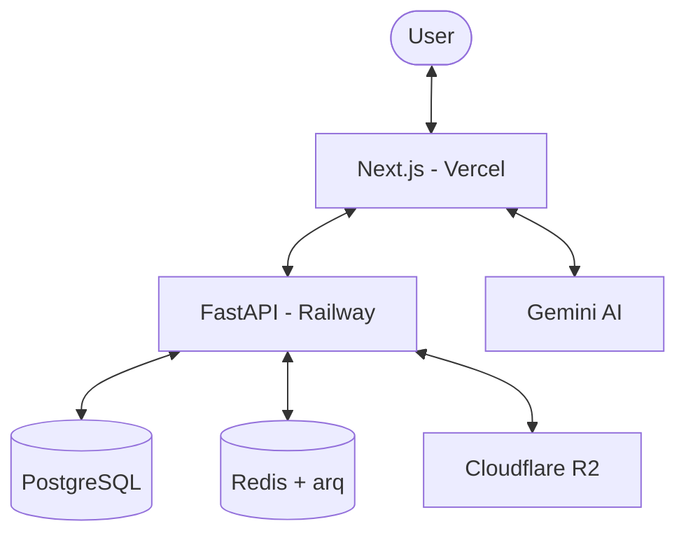

# 🚀 Digitalizing Calama: Production Deployment Guide

This guide describes how to deploy the GuelmaGuide platform from scratch using a professional, automated CI/CD pipeline.

## 🏁 Prerequisites

1.  **Accounts**:
    *   **GitHub**: For source control and CI/CD actions.
    *   **Vercel**: For Frontend hosting.
    *   **Railway**: For Backend and PostgreSQL hosting.
    *   **Cloudflare**: For DNS and R2 storage.
    *   **Stripe**: For marketplace payments.
    *   **Google Cloud**: For AI (Gemini) and Search/Maps.

## 📦 Service Architecture

---

## 🛠 Step 1: Database & Cache (Railway)

1.  Create a new project on **Railway**.
2.  Provision a **PostgreSQL** instance.
3.  Provision a **Redis** instance.
4.  Copy the `DATABASE_URL` and `REDIS_URL`.
5.  In the `backend` folder locally, run: `alembic upgrade head` (ensure your env is connected).

## 🛠 Step 2: Backend (Railway)

1.  Connect your GitHub repo to Railway.
2.  Add the `/backend` directory as a service.
3.  Configure **Environment Variables** (see `ENVIRONMENT.md`).
4.  Railway will detect the `Procfile` and start the web worker.

## 🛠 Step 3: Frontend (Vercel)

1.  Import your GitHub repo into **Vercel**.
2.  Select the root directory.
3.  Configure **Environment Variables**.
4.  The `vercel.json` will handle the `/api/v1` proxying to the Railway backend.

## 🛠 Step 4: CI/CD Automation (GitHub Actions)

To enable `git push` deployments, you must add these secrets to your GitHub Repository (**Settings > Secrets and variables > Actions**):

| Secret Name | Source | Use Case |
| :--- | :--- | :--- |
| `RAILWAY_TOKEN` | Railway Dashboard | Auth for backend deploy |
| `VERCEL_TOKEN` | Vercel Settings | Auth for frontend deploy |
| `VERCEL_ORG_ID` | Vercel Project | Scoping the command |
| `VERCEL_PROJECT_ID` | Vercel Project | Scoping the command |

Once added, every push to `main` will trigger `.github/workflows/deploy.yml`.

---

## 🔍 Verification Checklist

1.  [ ] **Health Check**: Visit `https://api.guelma.guide/health`. Expected: `{"status": "ok"}`.
2.  [ ] **i18n Support**: Visit `/ar` and `/fr`. Ensure layouts flip correctly.
3.  [ ] **AI Guide**: Ask for "Thermal baths near Guelma". Verify Gemini responds.
4.  [ ] **Auth Popups**: Ensure Google Login works on the production domain.
5.  [ ] **Image Persistence**: Upload a place image. Verify it's visible after a page refresh (Check R2).

## 🆘 Debugging

*   **401 Unauthorized**: Check if `JWT_SECRET_KEY` is identical on both Vercel and Railway.
*   **CORS Issues**: Ensure your Vercel URL is explicitly listed in `BACKEND_CORS_ORIGINS`.
*   **Failed Build**: Check Vercel logs for missing `npm` dependencies.
*   **DB Connection Error**: Ensure the Railway instance allows connections from the backend IP (usually automatic).
